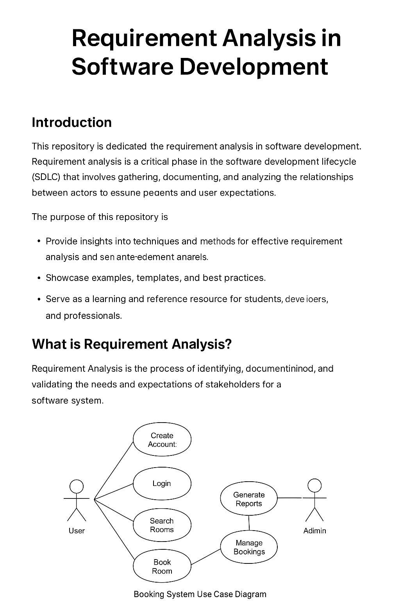

# Requirement Analysis  

## What is Requirement Analysis?  
Requirement Analysis is the process of identifying, documenting, and managing the needs and expectations of stakeholders for a system or project. It forms the foundation of software development, ensuring that the final product addresses the right problems and delivers value.  

During requirement analysis, developers and stakeholders collaborate to clarify what the system should do, how it should behave, and the constraints under which it must operate.  

---

## Why is Requirement Analysis Important?  
Requirement Analysis is critical because it directly impacts the success or failure of a project. A well-executed requirement analysis ensures that the final system aligns with stakeholder needs, avoids wasted effort, and minimizes costly mistakes later in development.  

### Key Reasons Why It’s Important:  
- **Prevents Miscommunication**: Clearly defines expectations so that everyone (stakeholders, developers, testers) shares the same understanding.  
- **Saves Time and Cost**: Identifies potential issues and risks early, reducing rework and unnecessary development efforts.  
- **Ensures Business Value**: Confirms that the solution solves the right problems and contributes to organizational goals.  
- **Improves Quality**: Provides precise criteria for design, development, and testing, leading to a more reliable system.  
- **Enhances User Satisfaction**: Ensures user needs and pain points are addressed, creating a product that people actually want to use.  
- **Supports Project Planning**: Helps in estimating timelines, resources, and scope more accurately.  

In short, requirement analysis lays the groundwork for a successful software project by ensuring that the team builds **the right system, the right way, for the right users**.  

---

## Use Case Diagrams

### What are Use Case Diagrams?
A **Use Case Diagram** is a visual representation of how users (actors) interact with a system to achieve specific goals. It captures functional requirements by illustrating the relationships between actors and use cases.

**Benefits of Use Case Diagrams:**
- Provides a **clear overview** of system functionality.  
- Helps identify **interactions between users and the system**.  
- Facilitates communication between stakeholders and developers.  
- Acts as a **foundation for creating detailed requirements and test cases**.  

### Booking System Use Case Diagram
Below is the use case diagram for the **Booking Management Project**, showing the primary actors (User and Admin) and their interactions with the system:

## Acceptance Criteria

### What is Acceptance Criteria?
Acceptance Criteria (AC) are **predefined conditions that a software product or feature must meet to be accepted by the stakeholders or end users**. They serve as a checklist that determines whether the implementation of a requirement is complete and working as intended.  

### Importance of Acceptance Criteria in Requirement Analysis
- **Clarity and Alignment**: Ensures that stakeholders, developers, and testers share the same understanding of what “done” means for a requirement.  
- **Guides Development**: Helps developers know exactly what functionality is expected before coding begins.  
- **Facilitates Testing**: Provides testers with specific, measurable conditions to validate during quality assurance.  
- **Reduces Ambiguity**: Minimizes misunderstandings by converting vague requirements into concrete, testable statements.  
- **Improves Stakeholder Confidence**: Demonstrates that requirements are being met as expected, increasing satisfaction.  

---

### Example: Acceptance Criteria for the Checkout Feature

For a **Booking Management System**, the **Checkout** feature might have the following acceptance criteria:

- Users must be able to review their booking details (dates, room type, price) before payment.  
- The system must support at least two payment methods (e.g., credit card and PayPal).  
- Payment information must be securely encrypted and stored according to industry standards.  
- A confirmation message must be displayed immediately after successful payment.  
- The system must send a confirmation email with booking details within 5 minutes of checkout.  
- If payment fails, users must see an error message and be able to retry or select another payment method.  

---
